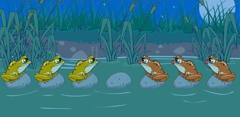

# A* Search Algorithm and Simulated Annealing

## Introduction

This project is a part of the course "Artificial Intelligence" at the University of Technology, Sydney. The project is to implement a generic A* search algorithm that can be used to solve a variety of problems and to implement a Simulated Annealing algorithm to find the global minimum and maximum of any function.

## A* Search Algorithm

The A* Search Algorithm is a best-first search algorithm that finds the least-cost path from a given initial node to one goal node (out of one or more possible goals). It uses a heuristic function to estimate the cost of the cheapest path through node n. The heuristic function is problem-specific. If the heuristic function is admissible, meaning that it never overestimates the actual cost to get to the goal, then A* is guaranteed to return a least-cost path from start to goal.

The algorithm was tested on two problems: the Jumping Frogs problem and the Route Planning problem.

### Problem 1: Jumping Frogs

#### Problem Description

The puzzle involves seven rocks and six frogs. See Fig. 1. The seven rocks are laid out in a horizontal line and numbered left to right. The six frogs are evenly divided into a green trio and a brown trio. The green frogs sit on Rocks 1, 2, and 3, facing right. The brown frogs sit on Rocks 5, 6, and 7, facing left. Rock 4 is vacant.

The challenge is to transpose the trios, jumping the green frogs to Rocks 5, 6, and 7 and the brown frogs to Rocks 1, 2, and 3. Their movement is restricted. A frog can only jump forward, either hopping to a vacant rock one place ahead (cost =1) or leaping over its neighbor frog to a vacant rock two places ahead (cost = 2).

#### Problem Formulation

The problem can be formulated as a search problem. The state space is the set of all possible positions of the frogs. The green frogs are denoted as `g`, the brown frogs are denoted as `b` and the vacant rock is denoted as `0`. The initial state is the initial position of the frogs 
`ggg0bbb` and the goal state is the final position of the frogs i.e `bbb0ggg`. The actions are the possible moves of the frogs. The cost of each action is 1 or 2. The heuristic function is the number of frogs that are not in their final position.

#### Results

The A* search algorithm was able to find the least-cost path from the initial state to the goal state with a cost of 24 and 16 steps.

### Problem 2: Route Planning

#### Problem Description

The problem is to find the shortest path from a given initial node to a given goal node in a graph. The graph is represented as a list of edges. Each edge is a tuple of the form (node1, node2, cost), where node1 and node2 are the nodes connected by the edge and cost is the cost of the edge. The graph is undirected. The cost of an edge is the Euclidean distance between the two nodes connected by the edge.

#### Problem Formulation

The problem can be formulated as a search problem. The initial state is the initial node. The goal state is the goal node. The actions are the possible moves from a node to its neighbors. The cost of each action is the cost of the edge between the node and its neighbor. The heuristic function is the Euclidean distance between the current node and the goal node.

#### Results

The Route Planning problem was tested the dataset in the `CSV` folder. The results are shown in Table 1.

| Initial Node | Goal Node | Cost |
| ------------ | --------- | ---- |
| Islamabad            | Hunza         | 623    |
| Kaghan            | Gilgit         | 268    |
| Muzaffarabad            | Khunjerab Pass         | 793    |

Table 1: Results of the A* search algorithm on the Route Planning problem

## Simulated Annealing

Simulated Annealing is a probabilistic technique for approximating the global optimum of a given function. Specifically, it is a metaheuristic to approximate global optimization in a large search space for an optimization problem.

## Contributors

- [Ali Asghar Chakera](www.github.com/aliasgharchakera)
- Anosha Fazli